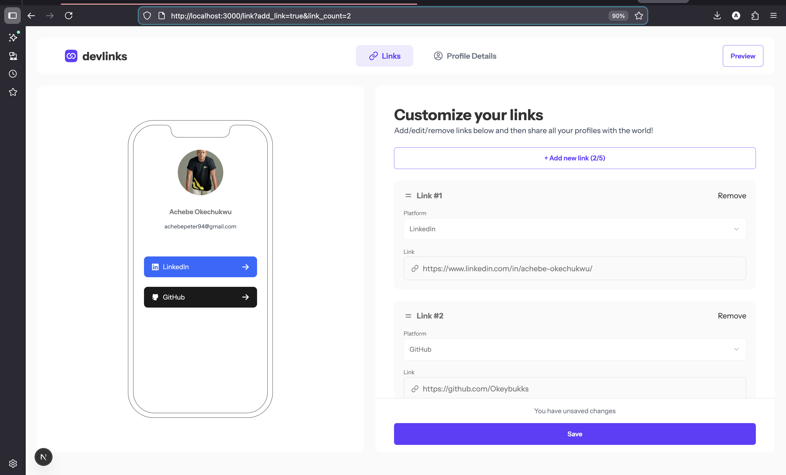

## Linker Frontend

This repository contains the frontend service for the DevOps Bootcamp Demo project Linker.
It is built with NextJS.
### Tech & Tools

This project is built with the following technologies:

- NextJS — frontend framework
- Node.js & TypeScript
- npm for dependency management
- Folder structure follows best practices for scalability

### Getting Started
Follow these steps to run the backend locally:
1.	Clone the repository
    ```
    git clone https://github.com/DevOps-Bootcamp-2026/devops-bootcamp-linker-frontend.git
    ```
2.	Navigate into the project folder
    ```
    cd devops-bootcamp-linker-frontend
    ```
3.	Install dependencies
    ```
    npm inatall
    ```
4. Edit .env file

    Rename the .env.example file to .env
    ```
    # NestJS backend url
    NEXT_PUBLIC_API_URL=http://localhost:3001/api
    ```

5. Start Application

    ```
    npm run dev
    ```

    
> The frontend service will be available here:(http://localhost:3001).